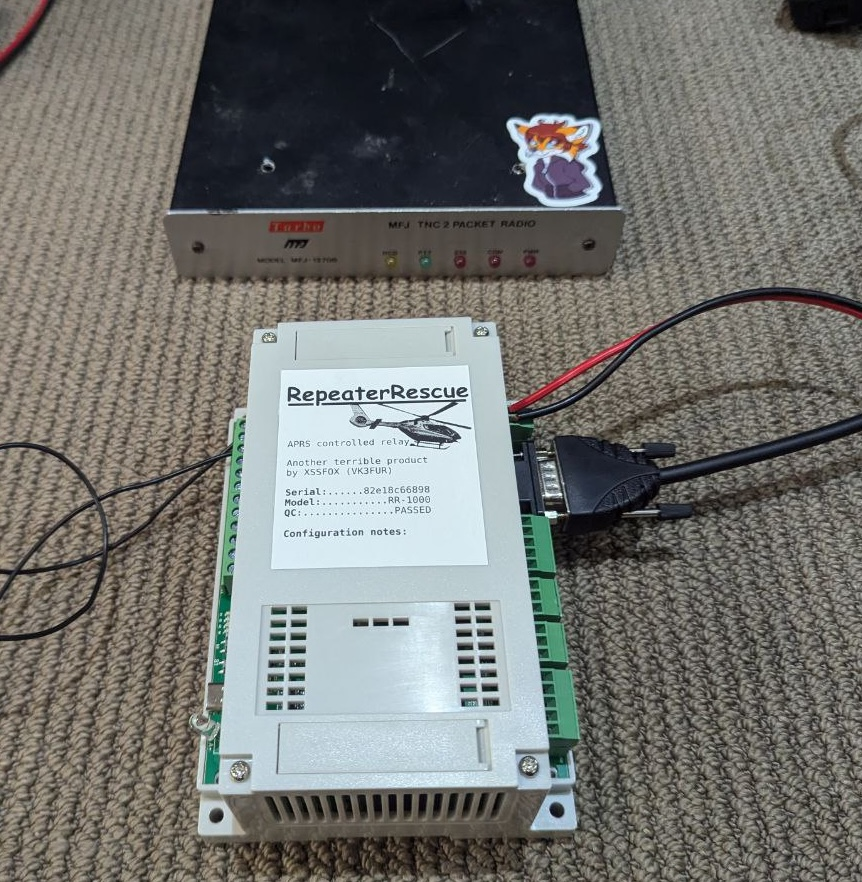
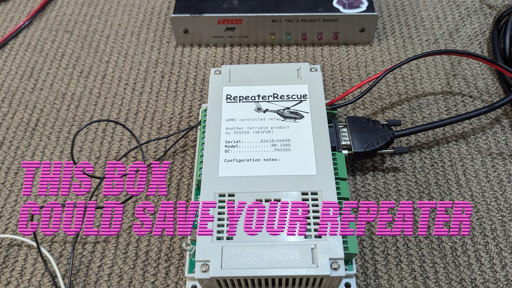

# Repeater Rescue
Repeater Rescue is an appliance built on top of the [KC868-A4](https://www.kincony.com/kc868-a4-hardware-design-details.html) DIN mounted EPS32 board that can be installed with existing APRS TNCs to perform basic hardware functions like triggering a relay on/off or pulsed. The intention is that repeater operators can use this platform to reset/restart or isolate hardware remotely when a fault occurs. Unlike other solutions Repeater Rescue provides a more secure method of performing these actions while remaining accessible, easy to use and permitted under most amateur radio licensing rules. 



## Basic use case
1. Repeater needs turning off due to pirates
2. The operator will generate a token using an authenticator app (such as Aegis or Google Authenticator )
3. To turn off the repeater the operator choses to turn off relay one. This is done by sending an APRS message to RepeaterRescue
  1. The first value in the message is the relay number (`1` in this case)
  2. The second value is the action, `0` off, `1` on, `2` pulse.
  3. Finally the message ends with the token
4. The final message is 10888888 (where 888888 is the token)
5. Repeater Rescue will validate the token is correct and turn off the repeater and thwarting the pirate.

#### Demo Video
> [](https://youtu.be/uxN0R1y9mRE)

## Setup

### Requirements
- git installed
- Arduino IDE installed
- A [KC868-A4](https://www.kincony.com/kc868-a4-hardware-design-details.html)

### TNC configuration

TNC should be set to KISS mode. The default configuration will try to detect a non KISS state for MFJ 1270B TNCs however this shouldn't relied upon.

Every TNC is different but you could try:
```
KISS ON
SAVE
RESTART
```

### Clone

```
git clone https://github.com/xssfox/repeaterrescue.git
```

### Arduino setup

0. Connect the KC868-A4 to PC with a USB-C cable and power the device with 12v
0. Ensure you have the correct serial drivers installed
0. Configure [ESP32 support in Arduino](https://docs.espressif.com/projects/arduino-esp32/en/latest/installing.html)
   1. Add `https://espressif.github.io/arduino-esp32/package_esp32_index.json` to `Additional boards manaher URLs` in Arduino's Settings / Preferences
   2. Open the board manager (Tools -> Board -> Board Manager)
   3. Install the `esp32` board
1. Open the freshly cloned repo in Arduino IDE
2. Open the library manager and install
  - `SimpleHOTP`
3. Edit the top of `repeaterescue.ino` with the configuration required
3. In Tools -> Board make sure `NodeMCU-32S` is selected
3. Make sure you select the serial port in Tools -> Port. Also set the baud rate to `460800`
3. Press upload
4. ~~???? write a GitHub issue because something went wrong and it wasn't documented here~~
5. Continue to **First Boot**

### First Boot

If the upload finished correctly you should hear some beeps. If you don't hear beeps double check the upload worked correctly.

1. Open the serial monitor. (This can actually be done with any serial monitor software) and set the baud rate to 115200.
2. Press the the `S1` button (located directly next to the USB-C port) - this will trigger a reboot and a beep
3. On reboot the serial output should provide a QR code and URL. Either can be used to configure associated HOTP apps. If the QR Code isn't scannable try copying into another text editor with a font that doens't have a large line spacing (such as DejaVu Sans Mono in TextEdit.app).

> [!WARNING]
> Don't share the QR Code or URL with anyone unless you want them to have access to this system. This is the private key / secret of the system

## Suggested HOTP apps

- **Aegis** seems to work well. After setup it allows you to change the counter value (this is beaconed on APRS in case it becomes desync'd)
- **Google Authenticator** works, however you can't set the HOTP counter. It does let you view it so you can refresh the token but clicking on it multiple times until its in sync - alternatively you can delete the token and reimport it (if you saved the URL) and manually set the counter in the URL

### Authenticator apps which DON'T WORK
 - **Bitwarden Authenticator** - no HOTP support
 - **Bitwarden client** - no HOTP support
 - **Microsoft Authenticator** - no HOTP support

## Usage
Send a message to the configured callsign with the following
```
[Relay 1-4][Command 0-2][Token]

Command
0 = off
1 = on
2 = pulse
```

For example `12888888` means pulse relay 1

> [!CAUTION]
> Once the message has been sent, anyone could have received the token. If the repeater doesn't perform the action or reply it's important to ensure the HOTP counter has been incremented to prevent someone from reusing this token. If you want to burn a token without performing an action you can send `[00]TOKEN` eg. `00888888`

### HOTP counter
This system works by having an incrementing counter which is used along with the secret to generate a token. The HOTP counter is broadcast over APRS, along with after every command so that operators can synchronize their authenticator apps with it.

After a token is used it won't be valid for further commands. You will have to refresh the authenticator app to get the next token.

## Security considerations

While this HOTP method of repeater control is more secure than traditional DTMF static number passcodes it isn't perfect. An attacker could jam your transmission to steal a code for example.

Ideally we would sign the entire message however a compromise was made to keep the system accessible and simple. This means that operators don't need a special app or special radio interfaces.

Malicious users on amateur radio are somewhat rare, and the expected usage of RepeaterRescue is low that the real world security concerns are somewhat limited.

### Lock outs
The system contains a timed lockout. This is configurable and is designed to stop people trying to guess every HOTP number. This functionality also adds another security consideration. It's possible that a user could cause a denial of service to the control system.

### Why HOTP and not TOTP
TOTP would certainly be a better option however many sites have no way to reliably get time.


## Future functionality
Some functionality that is possible with this platform, but will require some investment to implement.

 - APRS-IS / KISS TCP beaconing
 - Telemetry reporting of the digital, analog, weather inputs available on the board
 - Adding an inbuilt TNC modem
 - Web and Bluetooth interfaces
 - TOTP

## Why the KC868-A4
I found the board while looking for an ESP32 with an ok looking RS232 driver. Given it has relays straight on the board and what appears to be a half decent hardware configuration it looked like worth trying. It also comes in a nice DIN case which might be useful for operators.

## Why not DTMF
DTMF can have issues with decoding reliably especially when two numbers next to each other. The other issue is that the operator might not be within range. APRS allows us control over the APRS digipeater network.

## Is it legal to use on Amateur Radio?
In Australia our rule is

> subject to subsection (3), a signal that is encoded, for the purpose of obscuring the meaning of the signal.

Repeater Rescue does not obscure it's meaning. The HOTP token has no meaning. There's no message or secret information encoded in it.

## Reference Material
_(sorry to all the projects I butchered to make this all work)_
### Required Arduino Libs
Can be installed with the library manager
- [SimpleHOTP](https://github.com/jlusPrivat/SimpleHOTP)
- [QRCode](https://github.com/ricmoo/qrcode/)
###  Vendored libs
#### tncattach
Used for receiving and sending kissframes
- https://github.com/markqvist/tncattach

#### ax25beacon
Used to encode messages
- https://github.com/fsphil/ax25beacon

#### base32
Used to generate a pretty url for the hotp code
- https://github.com/NetRat/Base32

#### QRCode
Vendored because of a naming conflict with esp functions
- https://github.com/ricmoo/QRCode/issues/35